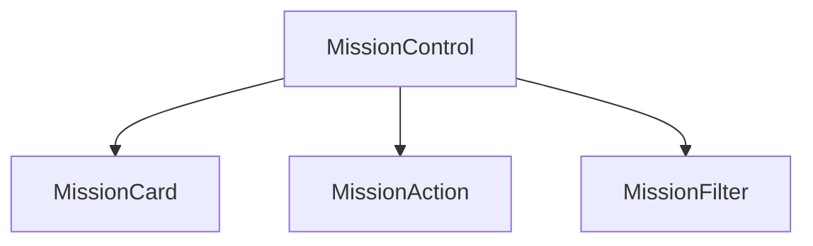

# Component Design Exercise

## Space Mission Control 🎛️

Hello, future software developer! In this exercise, we will practice component design in React by creating a comprehensive Space Mission Control dashboard. 💪

This is a great opportunity to enhance your understanding of component-based architecture, state management, event handling, and the flow of data between parent and child components in React applications. 🥳

Your primary goal is to develop an application that displays a list of space missions, each with detailed information such as the mission's name, current status, and the names of crew members assigned to the mission. The application will allow users to update the status of each mission, simulating a control dashboard that might be used in a space agency's mission control center.

Here's a working demo:

[Demo-2.mov](https://prod-files-secure.s3.us-west-2.amazonaws.com/163f1722-85e9-4a3c-adba-457a91094f00/4cc1b20c-e2af-4795-b6e3-d84bd5283282/Demo-2.mov)

## Component Design 🎨

The Space Mission Control application comprises several components, each responsible for a specific part of the application's functionality. Here's an overview of the components you'll create and how they interact:

- `MissionControl` is the core component that holds the state for space missions. It is responsible for rendering each mission's details and actions. It manages the mission list and its statuses, orchestrating the data flow to child components.
- `MissionCard` is a stateless component that displays information about a mission, such as its name, status, and crew. It receives all necessary data through props from `MissionControl` and focuses solely on presentation.
- `MissionAction` handles user interactions for each mission, allowing status updates through buttons like "Launch Mission." It operates by calling functions passed down from `MissionControl`, showcasing a direct way for child components to trigger state changes in the parent.
- `MissionFilter` enhances user experience by providing a mechanism to view missions by specific criteria, directly influencing the mission list rendered by `MissionControl`.

## Tasks 📋

1. Create a `MissionControl` component to manage and display missions with the following specifics:
   - Takes an array of missions from props, each mission with `id`, `name`, `status`, and `crew`.
   - Manages the state of mission details.
   - Render `MissionCard` for each mission to display its details.
   - Render `MissionAction` for each mission to update the mission status.
   - Render `MissionFilter` to filter missions by status.
2. Implement a `MissionCard` component to display mission details.
3. Implement a `MissionAction` component to:
   - Provide buttons for changing mission status.
   - Invoke a callback function passed from `MissionControl` to update the mission status.
4. Implement a `MissionFilter` component to offer buttons to set the current mission filter state in `MissionControl`.
5. Ensure the `MissionControl` component:
   - Updates the mission status immediately in the UI when a user interacts with `MissionAction`.
   - Updates the displayed missions based on the selected filter.

Happy coding!
